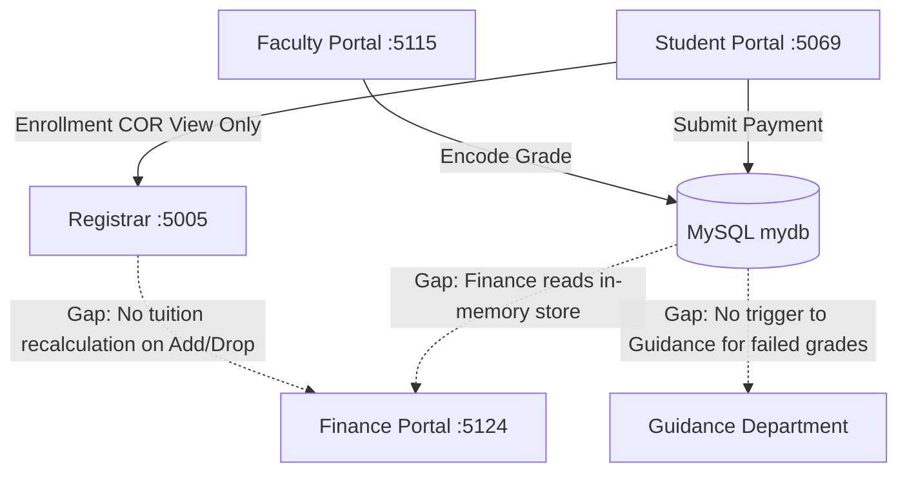

# 🏛️ AI Context: Campus System Comprehensive Issues, Gaps & Architectural Audit

> **Document Type:** AI Context & Master Issue Tracker  
> **Target System:** National University Lipa — Campus Management System  
> **Database:** Shared MySQL (`mydb`)  
> **Portals:** Registrar (`:5005`), Finance (`:5124`), Student Portal (`:5069`), Faculty Portal (`:5115`), Guidance (`TBD`)  
> **Last Updated:** 2026-09-29  

---

## 1. Executive Summary

The Campus System is designed as a multi-department ecosystem sharing **ONE centralized MySQL database (`mydb`)**. While all four primary web applications can run concurrently and have basic MySQL drivers installed, **the critical business logic flows between departments remain fractured**. 

All seven department applications now have a shared MySQL `mydb` connection path using integer `user.id`. Major portions still rely on in-memory mock datasets (especially Finance assessments), placeholder pages, or hardcoded identity sessions, so database connectivity must not be confused with end-to-end workflow synchronization.

---

## 2. Master Matrix of 26 System Issues Across 9 Categories



### Category I: 🗄️ Database & Schema Issues (`mydb` vs. Code)
1. **Inconsistent ID Types:**
    - The operational MySQL database uses integer `user.id`. Guidance and Registrar API paths now resolve this shared ID, but Finance's legacy assessment contracts still carry GUIDs and must not be joined directly to campus users without a mapping.
2. **Missing Relational Constraints & Foreign Keys:**
   - `student_payments` stores `student_id` without strict foreign keys to `fee_assessments(id)`.
   - `student_clearance` lacks cascading foreign key rules.
3. **Missing Tables from Architectural Design Board:**
   - **Tuition Fee Rate Matrix:** No dynamic table for unit rates (`₱1,500/unit`) and laboratory fees per program.
   - **Installment Payment Schedule:** No table tracking split terms (Downpayment, Midterm Installment, Final Installment).
   - **Library Management:** No `library_books`, `book_loans`, or `library_reservations` tables.
    - **Guidance Records:** `guidance_appointments`, `guidance_notes`, and `guidance_requests` are now bootstrapped in MySQL; the case-note/appointment UI and authorization workflow are not complete.
   - **Faculty Coursework:** No tables for `attendance_logs`, `assignments`, or `student_submissions`.

---

### Category II: 🏛️ Finance Department (`FinanceMain`) Gaps
4. **The In-Memory Data Store Trap (`FinanceDataStore`):**
   - The `/Assessments`, `/Billing`, and `/Payments` pages query a singleton in-memory C# list containing 9 hardcoded demo students (Maria Clara, etc.).
   - When a student pays via Student Portal, the transaction inserts into MySQL `student_payments`, but **Finance's admin ledger does not display it** because it reads from the in-memory store.
    - `FinanceDbService.UpdateClearanceStatusAsync` still falls back to student ID `5` when lookup fails; remove that fallback before using the clearance write path.
5. **Static Invoice Lookup:**
   - `/Invoice/{id}` queries the in-memory list only. Real students enrolled via Registrar show `"No assessment record found"`.
6. **Lumpsum Billing (No Installment Tracking):**
   - Finance views total balance as a single lumpsum with no breakdown for Downpayment, Midterms, or Finals.
7. **Document Fee Silo:**
   - `/RequestFees` processes isolated requests and does not link to real document petitions from Student Portal `/DocumentRequests`.
8. **Print Templates Lack Security Verification:**
   - OAO and Official Receipts lack verification QR codes, automated digital signatures, and barcode tracking.

---

### Category III: 📱 Student Portal (`StudentPortalMain`) Gaps
9. **Hardcoded Student Identity Session:**
   - `CurrentStudentId` in `StudentPortalDbService` is hardcoded to `1` or `5` (`Alyssa Bea Mendoza`). Other students in the `user` table cannot log in to view their own data.
10. **Missing Interactive Enrollment / Reservation Form:**
    - `/Enrollment` only displays an existing Certificate of Registration (COR). It lacks an interactive subject enlistment form with a *"Reserve / Submit Enrollment"* action.
11. **Hardcoded Tuition Assessment Calculation:**
    - `/Financials` uses a hardcoded fallback (`TotalAssessment = 32500.00m;`) instead of computing tuition dynamically based on the student's actual enrolled units and laboratory courses.
12. **Mock Pages Without Database Persistence:**
    - `/Library` (Book reservation) is not linked to a central campus book inventory.
    - `/Coursework` (Assignments) is static HTML not connected to Faculty Portal assignments.
    - `/Requests` (Guidance requests) does not reach a live counselor.
    - `/Scholarships` is a static list not connected to Finance's `Aid` ledger.

---

### Category IV: 🗂️ Registrar Department (`RegistrarMain`) Gaps
13. **Hardcoded Registrar Session:**
    - Any page load defaults the user to `Dr. Rosalinda Santos` (`user_id = 1`) without credentials.
14. **Silent Failure on Assessment Dispatch:**
    - When approving an enrollment in `/EnrollmentValidation`, the HTTP call to Finance's API (`/api/finance/assess`) has a 3-second timeout and silently catches exceptions, leaving students without tuition assessments if Finance is restarting.
15. **Add/Drop Without Tuition Recalculation:**
    - When Registrar approves an Add/Drop petition, `enrolled_subjects` updates, but **Finance receives no notification to add units fees or process refunds**.
16. **No Itemized Assessment (OAO) Visibility:**
    - Registrar cannot view the student's itemized OAO breakdown directly from the 201 Student Records view.

---

### Category V: 👨‍🏫 Faculty Portal (`FacultyPortalMain`) Gaps
17. **No Faculty Authentication / Instructor Assignment:**
    - Port 5115 exposes class rosters without requiring an instructor login or filtering by specific teacher ID.
18. **Static Mock Coursework Pages:**
    - `/Attendance` displays dummy checkboxes with no database persistence.
    - `/Assignments` and `/AssignmentDetail` display static demo assignments with no student submission tracking.
    - `/Feedback` displays static reviews with no persistence.

---

### Category VI: 🧭 Guidance Department (`GuidanceDepartmentMain`) Gaps
19. **Guidance shared-database integration:**
    - Guidance now uses the shared MySQL `mydb` connection and numeric `user.id`; student lookup and request/token persistence are active.
    - The UI remains partly static, and counselor authentication, clearance UI wiring, and cross-department referral authorization still need work.
20. **Guidance Clearance Disconnect:**
    - A Guidance MySQL service can upsert shared `student_clearance`, but there is no active counselor interface/approval workflow to sign it off.
21. **No Early Warning Intervention Trigger:**
    - When a faculty member encodes a failing grade (`5.00`) or `INC`, no notification or referral is dispatched to Guidance for academic counseling.

---

### Category VII: 🔄 The 5 Broken Cross-Department Business Lifecycles

#### Lifecycle 1: The Enrollment & Reservation Chain
```
[Student Portal: Subject Enlistment] 
    └──> [MySQL: INSERT INTO enrollments (status='reserved')]
          └──> [Registrar: Visible in Registration Queue]
                └──> [Finance: Auto-generate Assessment (OAO) & Installment Plan]
                      └──> [Student Portal: View Balance & Pay Downpayment]
                            └──> [Registrar: Auto-validate to 'active/enrolled']
                                  └──> [Faculty Portal: Appears on Class Roster]
```
* **Current Status:** **BROKEN.** Form does not exist in Student Portal; Finance assessment is not automatically generated; Downpayment does not trigger official enrollment.

#### Lifecycle 2: The Payment & General Ledger Loop
```
[Student / Cashier: Submit Payment] 
    └──> [MySQL: INSERT INTO student_payments]
          └──> [Finance: Real-time Credit to Ledger & Update Installment Schedule]
                └──> [Student Portal: Update Remaining Balance & Issue Official Receipt]
                      └──> [Registrar: Update Finance Clearance Status]
```
* **Current Status:** **BROKEN.** Payment writes to MySQL but Finance reads in-memory store; installment schedule is missing.

#### Lifecycle 3: Document Petition & 201 Vault Release
```
[Student Portal: Request TOR / Good Moral] 
    └──> [Finance: Bill Document Fee in Ledger]
          └──> [Student Portal: Pay Document Fee]
                └──> [Registrar: Notify 201 Vault to Print & Release Document]
```
* **Current Status:** **BROKEN.** Document requests do not bill to Finance; payment status is not tracked by Registrar.

#### Lifecycle 4: Add / Drop Subject Recalculation
```
[Student Portal: Petition Add/Drop] 
    └──> [Registrar: Approve Petition]
          └──> [Faculty Portal: Add/Remove Student from Class Roster]
                └──> [Finance: Recalculate Tuition Units & Lab Fees]
```
* **Current Status:** **BROKEN.** Registrar approves subject change, but Finance tuition bill remains unchanged.

#### Lifecycle 5: Faculty Grading to Scholastic Standing
```
[Faculty Portal: Encode Final Grade] 
    └──> [MySQL: Save to grades table]
          └──> [Student Portal: Display Grade on Report Card]
                └──> [Registrar: Recalculate Term GPA & Dean's List / Warning]
                      └──> [Guidance: Auto-referral if Grade is 5.00 or INC]
```
* **Current Status:** **PARTIAL.** Grades save to MySQL, but GPA standing, Dean's List, and Guidance triage are not triggered.

---

### Category VIII: 🔐 Authentication, Security & Role Management
22. **No Centralized Authentication Portal (`/Login`):**
    - No single sign-on or login interface exists.
23. **Zero Route Protection (No RBAC):**
    - Students can type `http://localhost:5005` and access Registrar administration directly.
24. **Plaintext Passwords:**
    - Passwords in the `user` table lack bcrypt/argon2 hashing and salt verification.

---

### Category IX: 🎨 UI, UX & Printing Deficiencies
25. **Mobile Viewport Overflow:**
    - Large data tables in Registrar and Finance lack horizontal scrolling wrappers on mobile screens.
26. **Unoptimized Print Views (`@media print`):**
    - Printing pages like Class Roster, Gradebook, or Billing Statements includes unwanted sidebars, headers, and buttons.

---

## 3. Targeted Roadmap & Priority Action Plan

| Phase | Focus Area | Deliverables |
|:---:|---|---|
| **Phase 1** | **Finance MySQL Persistence** | Shared MySQL connection and payment/clearance writes are active; replace the in-memory assessment/ledger store and verify end-to-end payment visibility. |
| **Phase 2** | **End-to-End Enrollment Loop** | Build interactive Enlistment Form in Student Portal. Wire reservation $\rightarrow$ Finance auto-assessment (OAO) $\rightarrow$ Downpayment $\rightarrow$ Registrar validation $\rightarrow$ Faculty Roster. |
| **Phase 3** | **Installment & Fee Schedule** | Implement Downpayment, Midterm, and Final installment tracking in both Student Portal and Finance. |
| **Phase 4** | **Document Requests & Add/Drop** | Wire Student Document Requests to Finance billing and Registrar 201 Vault. Wire Add/Drop approvals to Finance tuition adjustments. |
| **Phase 5** | **Guidance & Unified Auth** | Guidance request/token persistence is on MySQL `mydb`; build and validate real authentication, role protection, and counselor workflows. |
