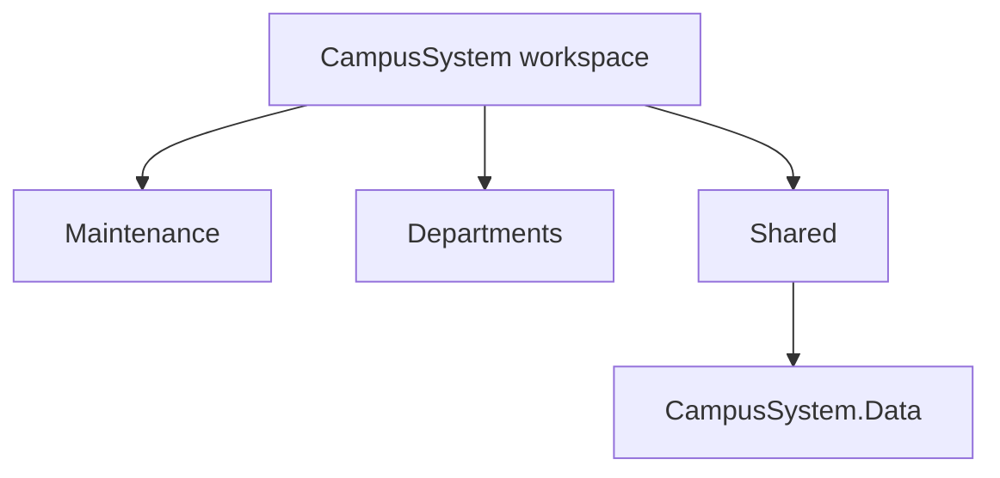

# Build Instructions: Update AI-Context Files for the Shared Campus Database

**Trigger for this update:** `BUILD-INSTRUCTIONS_Shared-Campus-Database.md` introduced `CampusSystem.Data` as one shared database used directly by all six departments. Every AI-context file that currently says "no live cross-department data" or "no shared class library" was written before this decision existed and is now out of date. Per each file's own "Required update pattern," these edits must be made before any future session relies on the old rules.

**Rule change, stated once:** Cross-department data access is now approved **only through `CampusSystemDbContext`** (the shared library). Direct calls into another department's controllers, services, or API endpoints are still **not** approved — the boundary moved from "no sharing" to "shared data store, separately owned API surfaces." This distinction must be preserved in every edit below; it is not a blanket removal of the isolation rules.

---

## 1. Workspace-level AI context (`AI-CONTEXT_DepartmentMaintainance.md` / root context)

**Find:** the statement that no shared class library exists and all service source is duplicated per project.

**Replace with:** clarify this is now only true of the *service* layer. Add a line noting `Shared/CampusSystem.Data` is the one shared library in the workspace, referenced (not copied) by every department project, and that it owns the single database schema and migration history.

**Also add to the Repository Map table:**

| Area | Purpose |
|---|---|
| `Shared/CampusSystem.Data` | Shared EF Core models, `CampusSystemDbContext`, and the single migration history for the campus database |

---

## 2. `PROJECT_MAP.md`

**Add** `Shared` as a new root-level folder in both the folder list and the Mermaid diagram:



**Add** to the Root-Level Folders list:
```
- [Shared/CampusSystem.Data](Shared/CampusSystem.Data)
```

---

## 3. Registrar's `Ai-context_(Registrar).md`

Already partially updated from the standalone-database build. Revise the following:

- **How to edit this project** — replace references to a Registrar-only persistence foundation with: "Registrar's data lives in the shared `CampusSystemDbContext`, under the `registrar` SQL schema. No standalone `RegistrarDbContext` or `RegistrarDb` remains."
- **Change Rules** — replace `RegistrarDbContext` with `CampusSystemDbContext`; add: "Registrar owns the `registrar` schema and its own controllers/services, but the underlying database is shared — do not assume table names are unique across schemas without qualifying them."
- Remove any leftover instruction to keep a separate `RegistrarDb` connection string; point instead to the shared `CampusSystemDb` key.

---

## 4. FacultyPortal, Finance, Library, StudentPortal — `Ai-context_(*).md` (all currently unwired)

Each of these four still says persistence, database writes, and live service calls are **not** approved for their placeholder pages. That rule stays correct for now — none of them has been wired to `CampusSystemDbContext` yet. But add one clarifying sentence to each file's **"What not to add while editing the interface"** section, so a future session understands *why* the door isn't open yet, not that it's permanently closed:

> "A shared campus database (`CampusSystem.Data`) now exists and this department is expected to be wired to it eventually, following the same pattern used for Registrar. Do not add persistence ad hoc — wait for that department-specific build to happen deliberately, using the shared `CampusSystemDbContext`, not a standalone database."

This prevents two failure modes: a future session assuming nothing has changed anywhere, and a future session wiring up persistence incorrectly (e.g. creating another standalone `FinanceDb`) instead of extending the shared context.

---

## 5. GuidanceDepartment's `Ai-context_(GuidanceDepartment).md`

This one needs slightly more than the others, because GuidanceDepartment already has real in-memory services (`InMemoryGuidanceRequestStore`, `AuditLogService`) that were explicitly flagged as non-durable. Add a note under **Change Rules**:

> "When GuidanceDepartment's persistence is wired up, its data belongs in the `guidance` schema inside the shared `CampusSystemDbContext`, replacing `InMemoryGuidanceRequestStore` — not a standalone GuidanceDepartment database. Case notes and audit events require an explicit authorization/durability decision before this migration happens; do not move them automatically as part of a routine schema addition."

---

## 6. Cross-cutting: every department's "no live cross-department data" language

Search each of the six files for statements like:

- FacultyPortal / Finance / Library / Registrar: no explicit cross-department blocking language exists in isolation — these mostly say "no persistence," which is handled above.
- **StudentPortal specifically** has the strongest explicit blocks: "No live library-status data pulls until a contract... No live announcements/notifications feed... until a contract with the source system... is approved."

**For StudentPortal**, add a clarifying line rather than deleting the restriction outright, since the underlying departments (Library, Registrar/faculty messaging) aren't wired to the shared database yet themselves:

> "The shared `CampusSystemDbContext` is the approved mechanism for this kind of cross-department read once the source department (Library, Registrar, etc.) has its own data wired into it. Until a given source department completes that build, treat its data as still unavailable — the contract is the shared schema being populated, not just its existence."

This keeps StudentPortal from either (a) ignoring the new database entirely, or (b) assuming it can read Library data that doesn't exist in the shared schema yet just because the shared database itself exists.

---

## Verification checklist

After making all edits above, confirm for each of the six department files and both workspace-level files:

- [ ] No file still claims "no shared class library exists" without the service-layer/data-layer distinction
- [ ] No file still references a standalone per-department database (`RegistrarDb`, or similar, if invented elsewhere)
- [ ] Every file distinguishes "shared data store" from "shared API surface" — the latter is still not approved
- [ ] `PROJECT_MAP.md` lists `Shared/CampusSystem.Data`
- [ ] Each file's own "Required update pattern" section order was followed (Ownership → How to edit → Department UI → Files to edit → Change Rules) so the edits don't leave sections internally inconsistent