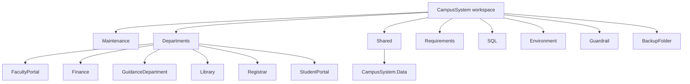

v# Campus System Project Map

## Overview

This workspace is a campus-wide multi-department system managed as a single VS Code project in the root folder named CampusSystem. It contains one shared maintenance dashboard and separate application projects for each department.

## VS Code 2026 Project Structure

## Root-Level Folders

- [Maintenance](Maintenance)
  - [Maintenance/index.html](Maintenance/index.html)
  - [Maintenance/AI-CONTEXT_DepartmentMaintainance .md](Maintenance/AI-CONTEXT_DepartmentMaintainance%20.md)
  - [Maintenance/Agenswarmspec.md](Maintenance/Agenswarmspec.md)
  - [Maintenance/Run-MaintenanceMonitoring.bat](Maintenance/Run-MaintenanceMonitoring.bat)
  - [Maintenance/Start-MaintenanceDashboard.ps1](Maintenance/Start-MaintenanceDashboard.ps1)
  - [Maintenance/logs](Maintenance/logs)
  - [Maintenance/swarm](Maintenance/swarm)
    - [Maintenance/swarm/PLAN.md](Maintenance/swarm/PLAN.md)
    - [Maintenance/swarm/campus-review-swarm.json](Maintenance/swarm/campus-review-swarm.json)

- [Departments](Departments)
  - [Departments/FacultyPortal](Departments/FacultyPortal)
  - [Departments/Finance](Departments/Finance)
  - [Departments/GuidanceDepartment](Departments/GuidanceDepartment)
  - [Departments/Library](Departments/Library)
  - [Departments/Registrar](Departments/Registrar)
  - [Departments/StudentPortal](Departments/StudentPortal)

- [Shared/CampusSystem.Data](Shared/CampusSystem.Data) — shared `Student` identity model only; department schemas and migrations remain in their owning projects

- [Requirements](Requirements)
- [SQL](SQL)
- [Environment](Environment)
- [Guardrail](Guardrail)
- [BackupFolder](BackupFolder)

## Department Applications

### Faculty Portal
- [Departments/FacultyPortal/FacultyPortalMain](Departments/FacultyPortal/FacultyPortalMain)
- AI context: [Departments/FacultyPortal/FacultyPortalMain/Ai-context_(FacultyPortal).md](Departments/FacultyPortal/FacultyPortalMain/Ai-context_(FacultyPortal).md)

### Finance
- [Departments/Finance/FinanceMain](Departments/Finance/FinanceMain)
- AI context: [Departments/Finance/FinanceMain/Ai-context_(Finance).md](Departments/Finance/FinanceMain/Ai-context_(Finance).md)

### Guidance Department
- [Departments/GuidanceDepartment/GuidanceDepartmentMain](Departments/GuidanceDepartment/GuidanceDepartmentMain)
- AI context: [Departments/GuidanceDepartment/GuidanceDepartmentMain/Ai-context_(GuidanceDepartment).md](Departments/GuidanceDepartment/GuidanceDepartmentMain/Ai-context_(GuidanceDepartment).md)

### Library
- [Departments/Library/LibraryMain](Departments/Library/LibraryMain)
- AI context: [Departments/Library/LibraryMain/Ai-context_(Library).md](Departments/Library/LibraryMain/Ai-context_(Library).md)

### Registrar
- [Departments/Registrar/RegistrarMain](Departments/Registrar/RegistrarMain)
- AI context: [Departments/Registrar/RegistrarMain/Ai-context_(Registrar).md](Departments/Registrar/RegistrarMain/Ai-context_(Registrar).md)

### Student Portal
- [Departments/StudentPortal/StudentPortalMain](Departments/StudentPortal/StudentPortalMain)
- AI context: [Departments/StudentPortal/StudentPortalMain/Ai-context_(StudentPortal).md](Departments/StudentPortal/StudentPortalMain/Ai-context_(StudentPortal).md)

## Role of the Maintenance Dashboard

The maintenance layer monitors the health of each department, runs debug/build checks, reports service status, tracks operational logs, and provides a shared UI for system activity. It also includes the swarm configuration used for campus review automation and planning.

## Maintenance Assets

- [Maintenance/index.html](Maintenance/index.html) — central dashboard UI
- [Maintenance/AI-CONTEXT_DepartmentMaintainance .md](Maintenance/AI-CONTEXT_DepartmentMaintainance%20.md) — maintenance-specific AI context
- [Maintenance/Agenswarmspec.md](Maintenance/Agenswarmspec.md) — swarm specification and behavior notes
- [Maintenance/Run-MaintenanceMonitoring.bat](Maintenance/Run-MaintenanceMonitoring.bat) — maintenance monitoring launcher
- [Maintenance/Start-MaintenanceDashboard.ps1](Maintenance/Start-MaintenanceDashboard.ps1) — dashboard startup script
- [Maintenance/logs](Maintenance/logs) — operational and monitoring logs
- [Maintenance/swarm](Maintenance/swarm) — swarm planning and review configuration
  - [Maintenance/swarm/PLAN.md](Maintenance/swarm/PLAN.md)
  - [Maintenance/swarm/campus-review-swarm.json](Maintenance/swarm/campus-review-swarm.json)

## Summary

This project is structured as a campus system with:

- one central dashboard and operational view
- several independent department apps
- one department-specific AI context file per app
- shared support folders for infrastructure, requirements, and maintenance operations
- a maintenance swarm layer for planning and review tasks

This gives each department its own project boundary while keeping the campus platform organized in one VS Code workspace.
